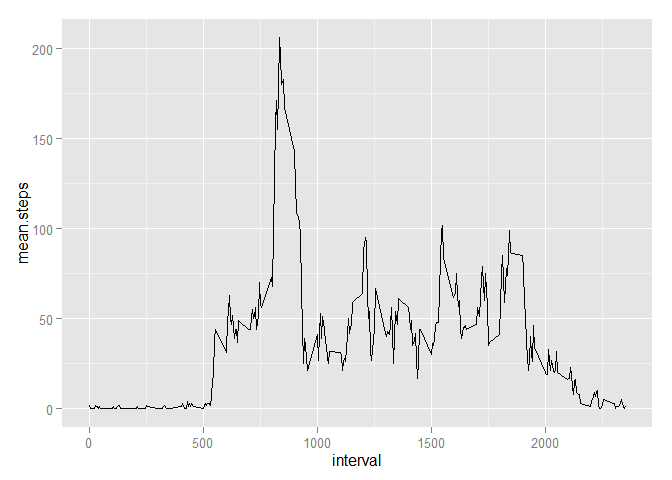
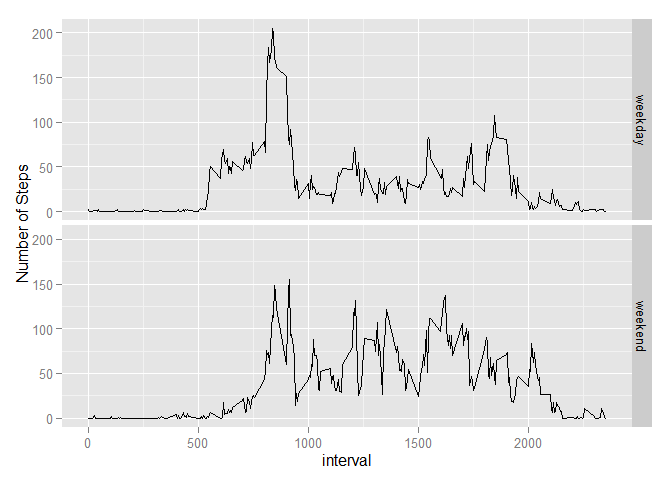

# Reproducible Research: Peer Assessment 1
### *By Murtuza Ali*  


**This document contains the completed work for peer assignment #1 for the Coursera Reproducable Research class.**  

**Below are the Steps/Questions that has been asked in the assignment. Detail of the assignment is in readme.md file.**  


### Loading and preprocessing the data  

Load the data (i.e. read.csv())

Process the data into a format suitable for analysis


```r
library(plyr)
library(ggplot2)

# read in the data
activity <- read.csv("activity.csv") 
# set the dates to POSIXct
activity$date <- as.POSIXct(activity$date)
```


### What is mean total number of steps taken per day?

For this part of the assignment, we can ignore the missing values in the dataset.

**1. Calculate the total number of steps taken per day**


```r
dailysteps <- aggregate(activity$steps, by = list(activity$date), sum, na.rm=TRUE) 
names(dailysteps) <- c("Date", "steps")
```

**2. Make a histogram of the total number of steps taken each day**


```r
qplot(steps, data = dailysteps, geom="histogram", xlab = "Daily Number of Steps", binwidth = 300)
```

 


**3. Calculate and report the mean and median of the total number of steps taken per day**


```r
mean.steps <- mean(dailysteps$steps) 
median.steps <- median(dailysteps$steps)
```

The mean number of steps each day is ***9354.2295082***  
The median number of steps each day is ***10395***  


### What is the average daily activity pattern?  

**1. Make a time series plot (i.e. type = "l") of the 5-minute interval (x-axis) and the average number of steps taken, averaged across all days (y-axis).**  


```r
#df of the mean and median number of steps taken, averaged across all days (y-axis)
intsteps <- aggregate(activity$steps, by = list(activity$interval), mean, na.rm=TRUE)
intstepsmed <- aggregate(activity$steps, by = list(activity$interval), median, na.rm=TRUE)

intsteps <- cbind(intsteps[], intstepsmed$x)

#Tidy the df names and round the numbers
names(intsteps) = c("interval","mean.steps", "median.steps")
intsteps$mean.steps <- round(intsteps$mean.steps)
intsteps$median.steps <- round(intsteps$median.steps)

ggplot(intsteps, aes(x = interval, y = mean.steps)) + geom_line()
```

 

**2. Which 5-minute interval, on average across all the days in the dataset, contains the maximum number of steps?**


```r
most.steps <- intsteps$interval[intsteps$mean.steps == max(intsteps$mean.steps)]
```

The interval with the most steps each day (on average is) : ***835***


### Imputing missing values  

Note that there are a number of days/intervals where there are missing values (coded as NA). The presence of missing days may introduce bias into some calculations or summaries of the data.  

**1. Calculate and report the total number of missing values in the dataset (i.e. the total number of rows with NAs)**


```r
#find the NAs
na.steps <- subset(activity, is.na(steps))
num.NAs <-length(na.steps$steps)
```

There are ***2304***  intervals with NA  


**2. Devise a strategy for filling in all of the missing values in the dataset. The strategy does not need to be sophisticated. For example, you could use the mean/median for that day, or the mean for that 5-minute interval, etc.**  


```r
#replace the NAs with the median number of steps for that period
nstps <- data.frame(date=activity$date[is.na(activity$steps)], interval = activity$interval[is.na(activity$steps)], steps=intsteps[match(intsteps$interval, activity$interval[is.na(activity$steps)]),3])
```

**3. Create a new dataset that is equal to the original dataset but with the missing data filled in.**  


```r
# remove the NA's from the period
activity <- subset(activity, !is.na(steps))

# Append the median steps to the Activity DF
activity <- rbind(activity, nstps)

#sum the number of steps each day into the dailysteps2 DF and get the mean and median 
dailysteps2 <- aggregate(activity$steps, by = list(activity$date), sum, na.rm=TRUE)
names(dailysteps2) <- c("Date", "steps")
```


**4. Make a histogram of the total number of steps taken each day and Calculate and report the mean and median total number of steps taken per day. Do these values differ from the estimates from the first part of the assignment? What is the impact of imputing missing data on the estimates of the total daily number of steps?**  


```r
qplot(steps, data = dailysteps2, geom="histogram", xlab = "Daily Number of Steps", binwidth = 300)
```

 


```r
mean.steps2 <- mean(dailysteps2$steps) 
median.steps2 <- median(dailysteps2$steps)
```
The new mean number of steps is ***9503.8688525*** this is close to the mean from the data with NAs of ***9354.2295082***. The new median number of steps is ***1.0395\times 10^{4}*** this is the same as the median from the data with NAs of ***10395***.  

**Answer: ** From these observations, it seems that the impact of imputing missing values on the total number of daily steps is negligible, so probably the original estimates have little bias due to missing values.s  
  
  
  
  
## Are there differences in activity patterns between weekdays and weekends?  

For this part the weekdays() function may be of some help here. Use the dataset with the filled-in missing values for this part.  

**1. Create a new factor variable in the dataset with two levels - "weekday" and "weekend" indicating whether a given date is a weekday or weekend day.**  
  

```r
# Add the Weekday/weekend identifier

activity$week <- ifelse(weekdays(activity$date) == "Saturday" | weekdays(activity$date) == "Sunday" ,"weekend","weekday")
```
  
**2. Make a panel plot containing a time series plot (i.e. type = "l") of the 5-minute interval (x-axis) and the average number of steps taken, averaged across all weekday days or weekend days (y-axis).**  


```r
#df of the mean and median number of steps taken, averaged across all days (y-axis)
intsteps2 <- aggregate(activity$steps, by = list(activity$week, activity$interval), mean, na.rm=TRUE)
intstepsmed2 <- aggregate(activity$steps, by = list(activity$week, activity$interval), median, na.rm=TRUE)

intsteps2 <- cbind(intsteps2[], intstepsmed2$x)

#Tidy the df names and round the numbers
names(intsteps2) = c("weekday", "interval","mean.steps", "median.steps")
intsteps2$mean.steps <- round(intsteps2$mean.steps)
intsteps2$median.steps <- round(intsteps2$median.steps)


ggplot(intsteps2, aes(x = interval, y = mean.steps)) + ylab("Number of Steps") + geom_line() + facet_grid(weekday~.)
```

 

